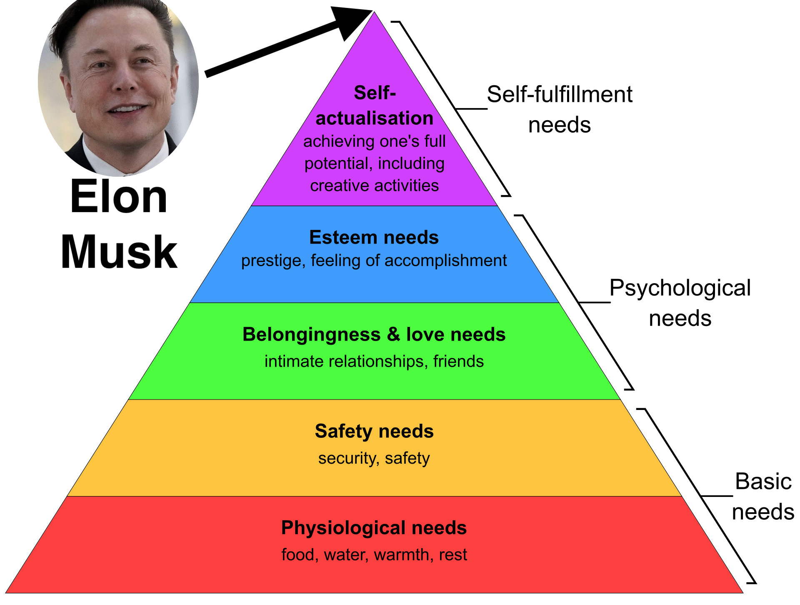

# Expectations for Twitter after the acquisition by Elon Musk and the enhancement possibilities of the platform.

Elon Musk is not only the richest man in the world, he is currently also one of the most intelligent and well-known people in the universe. After becoming the owner of twitter, many users hope that an edit button will be introduced and the verification of users with a checkmark will be faster and easier. 
But what progress and benefits will such little things like a button or a check mark bring to humanity? 

## One should have much higher ambitions. You can certainly have much higher expectations from Elon Musk.

A man of Elon Musk's caliber is capable of achieving greater things. He certainly don't buy Twitter for profit. Does he want to promote freedom of expression in the social networks? Or does he want to influence opinion and possibly become president?

## But what can we expect from Elon Musk? Expectations are to be collected here, especially in terms of software and data. What extensions and features can be useful for mankind?

<table>
<tr>
<th>Title</th>
<th>Description</th>
<th>Potential for people</th>
</tr>
<tr>
<td>Measure Free Speech</td>
<td> 
  - Metrics to measure Free Speech. 
  - World map with statistics for countries and continents
  - In which country do you receive the most complaints about tweets? In which countries are tweets blocked the most?
Which topics / tags have been blocked in the last weeks and months? 
  - In some countries twitter is completely blocked and therefore not accessible. Are there mechanisms like satellite networks or VPN or other protocols to still be able to inform the population?
</td>
<td>Middle</td>
</tr>
<tr>
<td>Communication platform for political discussions</td>
<td> 
  Many politicians are registered on Twitter and use it actively. They can use the platform for discussions and suggestions. 
  - International discussions can be coordinated and discussed globally via new mechanisms. 
  - Moderation options and a better thread visualization
</td>
<td>High</td>
</tr>
  <tr>
<td>Messaging service for things (IoT)</td>
<td> 
  - Devices can send messages via Twitter (already possible) 
  - Simple way to manage your own devices
  - Interface for manufacturers such as cars, refrigerators, washing machines, etc.
  - Use case: My car reminds me about the next inspection
</td>
<td>High</td>
</tr>
<tr>
<td>Twitter pay</td>
<td> 
  - Pay with twitter like Apple Pay 
  - Twitter account is like a bank account. 
  - With the app you can pay everywhere. 
  - You can transfer crypto currencies to other users. Start with Doge.
</td>
<td>High</td>
</tr>
<tr>
<td>Platform for Open Data</td>
<td> 
  - Share and discuss data. 
  - Open Data can be shared with followers much simpler. 
  - Journalists, human rights activists, authorities and governments as users. 
  - Systems feed data automatically and the data is anonymized and available to all Twitter users..
</td>
<td>High</td>
</tr>
</table>

## How to participate

https://forms.gle/wvkt1sSUsx9MNmwU9

New ideas and suggestions are welcome
